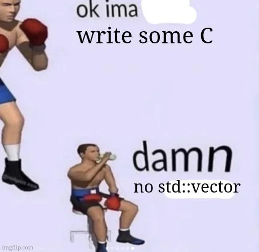

# CVec
std::vector but for C 
This library is full templated via macros 
No void* and casting hacks 

 

Vec_init - creates an empty vector with no memory allocated 
Vec_initArr - creates a vector by copying elements from a raw array 
Vec_initVec - creates a vector by copying another vector 
Vec_free - frees the internal buffer and resets the vector 
Vec_reserve - ensures capacity is at least a given size 
Vec_push - appends a single element to the end 
Vec_pushArr - appends multiple elements from a raw array 
Vec_pushVec - appends all elements from another vector 
Vec_pop - removes the last element 
Vec_popN - removes N elements from the end 
Vec_insert - inserts a single element at an index, shifting right 
Vec_insertArr - inserts multiple elements from an array at an index 
Vec_insertVec - inserts another vector at an index 
Vec_erase - removes one element at an index, shifting left 
Vec_eraseN - removes N elements starting at an index, shifting left
